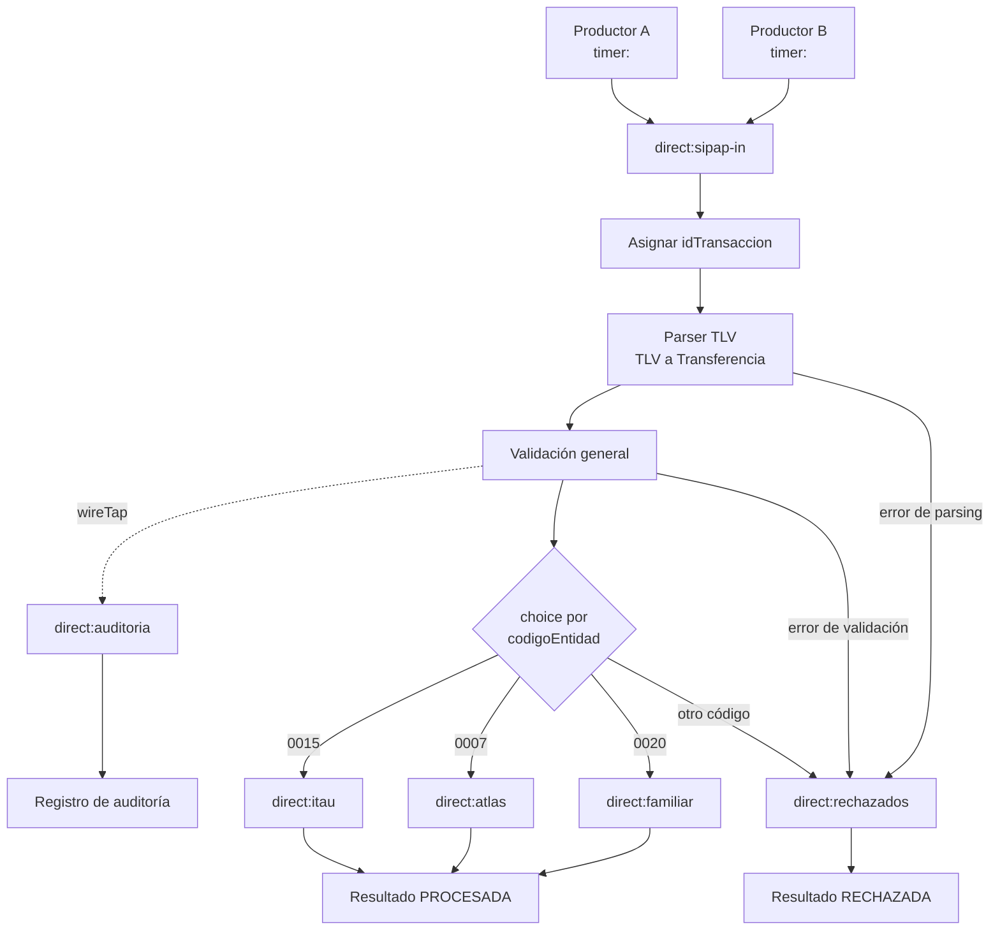

# Tarea 1 - Integración de transferencias SIPAP mediante Apache Camel

## Integrantes

- Ana Paula Duarte
- Steven Gracia Ayala

## Objetivo

Este proyecto simula el procesamiento de transferencias SIPAP representadas mediante cadenas QR en formato TLV. Apache Camel actúa como mediador: recibe los mensajes, coordina su parseo y validación, los transforma a un modelo común y los dirige al banco destino correspondiente.

La implementación es una simulación académica. No realiza transferencias reales ni se conecta con SIPAP o con entidades bancarias.

## Tecnologías

- Java 21
- Spring Boot 3.5.3
- Apache Camel 4.14.9
- Maven
- Java DSL
- JUnit 5

## Descripción del flujo

La aplicación utiliza dos productores `timer:` llamados Productor A y Productor B. Cada productor genera periódicamente cadenas TLV de prueba y las envía al canal interno `direct:sipap-in`.

Al recibir cada mensaje, la ruta principal le asigna un identificador con formato `TX000001`. Después, `TlvParserProcessor` interpreta la cadena TLV, incluyendo la estructura anidada del tag `32`, y la transforma en un objeto `Transferencia`. `ValidacionProcessor` comprueba los campos y las reglas generales de la transferencia.

Si el mensaje supera estas etapas, `wireTap("direct:auditoria")` envía una copia del objeto validado al canal de auditoría. A continuación, un `choice()` consulta el código de entidad y dirige la transferencia a uno de los consumidores:

- `direct:itau`
- `direct:atlas`
- `direct:familiar`

Cada consumidor bancario recibe exclusivamente un objeto `Transferencia` ya parseado y validado. Luego produce un `ResultadoTransferencia` con estado `PROCESADA`.

Los errores de parsing o validación se manejan sin detener la aplicación y terminan en `direct:rechazados`. El banco desconocido se rechaza en `TransferenciaRoute`, dentro de `choice()/otherwise`, y también se envía a `direct:rechazados`. En ambos casos se genera un `ResultadoTransferencia` con estado `RECHAZADA`, el identificador original y una causa concreta.

La auditoría ocurre después del parsing y la validación, pero antes del enrutamiento por banco. Por eso recibe transferencias válidas aunque su código bancario resulte desconocido posteriormente. No recibe mensajes que fallen durante el parsing o la validación.

## Estructura del proyecto

```text
src/
├── main/
│   ├── java/py/edu/ucom/is2/proyectocamel/
│   │   ├── ProyectoCamelApplication.java
│   │   ├── model/
│   │   │   ├── MerchantAccountInformation.java
│   │   │   ├── ResultadoTransferencia.java
│   │   │   └── Transferencia.java
│   │   ├── processor/
│   │   │   ├── TlvParserProcessor.java
│   │   │   └── ValidacionProcessor.java
│   │   ├── route/
│   │   │   └── TransferenciaRoute.java
│   │   └── service/
│   │       └── GeneradorQrService.java
│   └── resources/
│       └── application.properties
└── test/
    └── java/py/edu/ucom/is2/proyectocamel/
        ├── ProyectoCamelApplicationTests.java
        ├── processor/
        │   ├── TlvParserProcessorTest.java
        │   └── ValidacionProcessorTest.java
        ├── route/
        │   └── TransferenciaRouteTest.java
        └── service/
            └── GeneradorQrServiceTest.java
```

- `ProyectoCamelApplication`: inicia la aplicación Spring Boot.
- `MerchantAccountInformation`: representa los datos bancarios contenidos dentro del tag `32`.
- `Transferencia`: modelo canónico utilizado durante el flujo interno.
- `ResultadoTransferencia`: representa una operación procesada o rechazada y conserva su identificador.
- `TlvParserProcessor`: verifica la estructura y las longitudes TLV, interpreta el tag anidado `32` y traduce la cadena a `Transferencia`.
- `ValidacionProcessor`: aplica las validaciones generales de campos, método, GUID, moneda, monto y CRC. No decide si el banco es conocido.
- `GeneradorQrService`: construye cadenas con una función TLV que calcula las longitudes y rota los escenarios de prueba entre ambos productores.
- `TransferenciaRoute`: define los productores, canales `direct:`, procesamiento, auditoría, enrutamiento bancario y manejo de rechazados.
- `application.properties`: configura el nombre de la aplicación y los periodos de los productores.
- Las clases de prueba verifican el contexto, parser, validaciones, generación de los tres bancos y enrutamiento de un banco desconocido.

## Formato TLV

Cada campo sigue esta estructura:

```text
TAG + LONGITUD + VALOR
```

- `TAG`: identificador de dos dígitos.
- `LONGITUD`: cantidad de caracteres del valor, expresada con dos dígitos.
- `VALOR`: contenido del campo.

Por ejemplo, el valor `01` para el tag `00` tiene longitud `02` y se representa como:

```text
00 + 02 + 01 = 000201
```

Los tags utilizados son:

| Tag | Campo | Uso en el proyecto |
|---|---|---|
| `00` | Payload Format Indicator | Debe contener `01`. |
| `01` | Point of Initiation Method | `11` para QR estático o `12` para QR dinámico. |
| `32` | Merchant Account Information | Contiene una estructura TLV anidada con los datos de la cuenta. |
| `52` | Merchant Category Code | Los ejemplos utilizan `5731`. |
| `53` | Transaction Currency | Debe contener `600`, código usado para PYG. |
| `54` | Transaction Amount | Monto de la transferencia; es obligatorio para QR dinámico. |
| `58` | Country Code | Los ejemplos utilizan `PY`. |
| `59` | Merchant Name | Los ejemplos utilizan `JUAN PEREZ`. |
| `60` | Merchant City | Los ejemplos utilizan `ASUNCION`. |
| `63` | CRC | Para esta práctica debe contener `A1B2`. |

El valor del tag `32` se vuelve a interpretar como TLV y contiene:

| Sub-tag | Campo | Valor o significado |
|---|---|---|
| `00` | Globally Unique Identifier | `py.gov.bcp.sip` |
| `01` | Código de entidad | Código del banco destino. |
| `02` | Número de cuenta | Cuenta de prueba utilizada en la transferencia. |

## Bancos simulados

| Código | Banco |
|---|---|
| `0015` | ITAU |
| `0007` | ATLAS |
| `0020` | FAMILIAR |

## Validaciones

El proyecto aplica las siguientes reglas:

- Los campos obligatorios deben estar presentes y no pueden estar vacíos.
- La estructura TLV debe estar completa y sus tags y longitudes deben ser numéricos.
- La longitud declarada debe coincidir con la cantidad de caracteres disponible para el valor.
- No se permiten tags duplicados dentro del mismo nivel TLV.
- El tag `32` debe contener una estructura TLV anidada válida.
- `payloadFormatIndicator` debe ser `01`.
- `pointOfInitiationMethod` debe ser `11` o `12`.
- El GUID debe ser `py.gov.bcp.sip`.
- El número de cuenta debe provenir del sub-tag `02`.
- La moneda debe ser `600`.
- Para un QR dinámico (`12`), el monto es obligatorio.
- Para un QR estático (`11`), el monto puede omitirse.
- Cuando existe, el monto debe ser positivo.
- Se rechaza un monto mayor o igual a `10000000`.
- El CRC debe ser `A1B2`.
- Solo los bancos `0015`, `0007` y `0020` pueden procesar una transferencia.

La última decisión no corresponde a `ValidacionProcessor`. La ruta permite que un banco desconocido complete las validaciones generales y luego lo rechaza mediante `choice()/otherwise` en `TransferenciaRoute`. De esta manera, el mensaje nunca llega a ITAU, ATLAS ni FAMILIAR.

## Patrones EIP utilizados

1. **Message Channel:** los endpoints `direct:sipap-in`, `direct:itau`, `direct:atlas`, `direct:familiar`, `direct:rechazados` y `direct:auditoria` funcionan como canales internos entre las etapas.
2. **Pipes and Filters:** el mensaje pasa ordenadamente por producción, parsing, validación, auditoría, enrutamiento y procesamiento bancario.
3. **Message Translator:** `TlvParserProcessor` convierte la cadena TLV recibida en el modelo canónico `Transferencia`.
4. **Content-Based Router:** el `choice()` de `TransferenciaRoute` consulta `codigoEntidad` para seleccionar ITAU, ATLAS, FAMILIAR o el flujo de rechazados.
5. **Message Filter:** los errores de parsing o validación impiden que mensajes inválidos alcancen los consumidores bancarios. El `otherwise` cumple el mismo propósito para bancos desconocidos.
6. **Correlation Identifier:** el header `idTransaccion`, con formato como `TX000001`, se asigna al entrar en `direct:sipap-in`, se incorpora a `Transferencia` y se conserva en `ResultadoTransferencia`.
7. **Manejo de errores / Dead Letter Channel equivalente:** `onException(IllegalArgumentException.class)` captura errores de parsing o validación, los marca como manejados y dirige un resultado rechazado a `direct:rechazados`. Es un manejo equivalente y sencillo; no se utiliza un broker ni una cola de mensajes fallidos real.
8. **Wire Tap:** `wireTap("direct:auditoria")` envía una copia de la transferencia después del parsing y la validación, sin interrumpir el flujo principal. El tap ocurre antes del `choice()`, por lo que también audita transferencias válidas cuyo banco luego se rechaza como desconocido.

## Escenarios de prueba

Los productores rotan automáticamente entre estos escenarios:

| N.º | Escenario | Resultado esperado |
|---:|---|---|
| 1 | Transferencia válida para ITAU (`0015`) | Se dirige a `direct:itau` y produce estado `PROCESADA`. |
| 2 | Transferencia válida para ATLAS (`0007`) | Se dirige a `direct:atlas` y produce estado `PROCESADA`. |
| 3 | Transferencia válida para FAMILIAR (`0020`) | Se dirige a `direct:familiar` y produce estado `PROCESADA`. |
| 4 | Banco desconocido (`9999`) | Supera las validaciones generales, pero `choice()/otherwise` la dirige a `direct:rechazados`. |
| 5 | Longitud TLV incorrecta | El parser detecta que la longitud declarada no coincide con el contenido y la rechaza. |
| 6 | Monto igual a `10000000` | La validación lo rechaza porque el límite también incluye la igualdad. Valores superiores se rechazan por la misma regla. |
| 7 | CRC `FFFF` | La validación lo rechaza porque se esperaba `A1B2`. |

## Ejemplos TLV

Los siguientes ejemplos son generados por la lógica existente en `GeneradorQrService`.

QR válido para ITAU, cuenta `100001` y monto `150000`:

```text
00020101021232360014py.gov.bcp.sip01040015020610000152045731530360054061500005802PY5910JUAN PEREZ6008ASUNCION6304A1B2
```

QR con banco desconocido `9999`, cuenta `900009` y monto `300000`:

```text
00020101021232360014py.gov.bcp.sip01049999020690000952045731530360054063000005802PY5910JUAN PEREZ6008ASUNCION6304A1B2
```

QR con CRC inválido `FFFF`, banco ITAU y monto `450000`:

```text
00020101021232360014py.gov.bcp.sip01040015020610000152045731530360054064500005802PY5910JUAN PEREZ6008ASUNCION6304FFFF
```

## Ejecución

En macOS o Linux:

```bash
./mvnw test
./mvnw spring-boot:run
```

En Windows:

```bat
mvnw.cmd test
mvnw.cmd spring-boot:run
```

Durante la ejecución aparecen mensajes identificados como `[PRODUCTOR A]`, `[PRODUCTOR B]`, `[ENTRADA SIPAP]`, `[PARSEO]`, `[VALIDACION]`, `[ITAU]`, `[ATLAS]`, `[FAMILIAR]`, `[RECHAZADA]` y `[AUDITORIA]`.

## Pruebas

El resultado actual de las pruebas es:

```text
Tests run: 11
Failures: 0
Errors: 0
Skipped: 0
```

Las pruebas cubren el inicio del contexto, parsing válido, detección de longitud incorrecta, QR estático sin monto, generación y validación para los tres bancos, banco desconocido, límite de monto, CRC inválido y enrutamiento del banco desconocido exclusivamente hacia rechazados.

## Diagrama del flujo



El canal de auditoría parte de la salida válida de la etapa de validación. Los errores producidos dentro del parser o del validador se dirigen a rechazados y no pasan por `direct:auditoria`.

## Restricciones

- No utiliza ActiveMQ ni Artemis.
- No utiliza ningún broker de mensajería.
- No se conecta a bancos reales ni ejecuta transferencias financieras.
- Los endpoints `direct:` constituyen el canal interno de la aplicación.
- El valor CRC `A1B2` es una comprobación didáctica; no se calcula un CRC real.
- Las cadenas utilizadas no representan un QR financiero oficial ni deben emplearse en operaciones reales.
