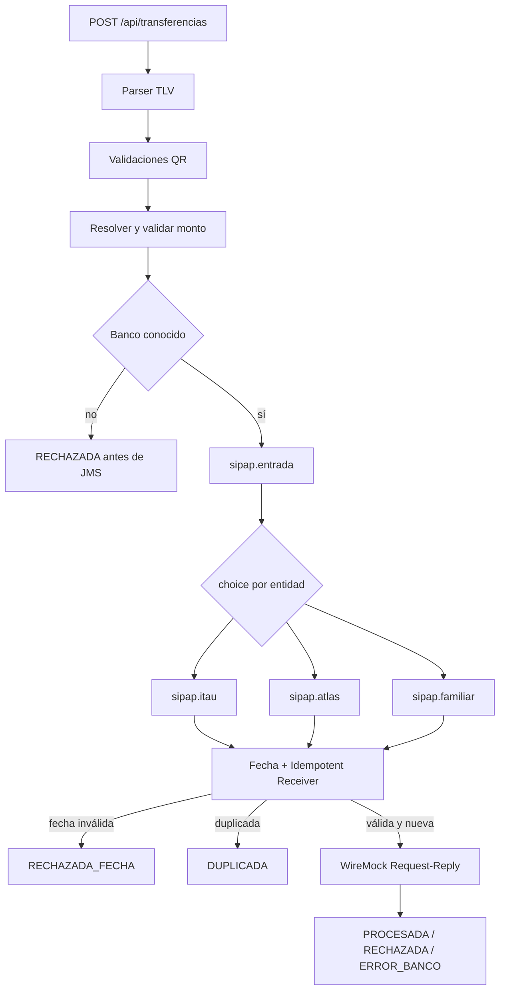

# Integración de transferencias SIPAP mediante Apache Camel y Artemis

## Integrantes

- Ana Paula Duarte
- Steven Gracia Ayala

## Objetivo de la Tarea 2

El proyecto académico simula transferencias SIPAP recibidas por REST. Apache Camel coordina el parsing de cadenas QR TLV, las validaciones, la publicación y el consumo mediante Apache ActiveMQ Artemis y la invocación Request-Reply de un banco simulado con WireMock.

La Tarea 2 evoluciona la solución de la Tarea 1: conserva el parser TLV, el modelo canónico y sus validaciones QR, pero reemplaza los timers como entrada principal por una API REST. Los timers no se ejecutan por defecto.

## Tecnologías

- Java 21
- Spring Boot 3.5.3
- Apache Camel 4.14.9
- Apache ActiveMQ Artemis 2.44.0
- JMS
- WireMock 3.13.1
- Docker Compose
- Maven
- Java DSL
- JUnit 5

## Ejecución

Se requiere Java 21 y Docker con Docker Compose.

```bash
docker compose up -d
docker compose ps
./mvnw test
./mvnw spring-boot:run
```

En Windows:

```bat
docker compose up -d
docker compose ps
mvnw.cmd test
mvnw.cmd spring-boot:run
```

Servicios locales:

- API: `http://localhost:8080`
- Artemis: `tcp://localhost:61616`
- consola Artemis: `http://localhost:8161`, credenciales `artemis/artemis`
- WireMock: `http://localhost:8081`

La conexión JMS anónima se permite únicamente para este entorno didáctico.

## API REST

### `POST /api/transferencias`

```json
{
  "id_transaccion": "TX000001",
  "fecha_transaccion": "2026-09-02",
  "qr": "00020101021232360014py.gov.bcp.sip01040015020610000152045731530360054061500005802PY5910JUAN PEREZ6008ASUNCION6304A1B2",
  "monto": "150000"
}
```

Respuesta inmediata cuando el mensaje se publica:

```json
{
  "id_transaccion": "TX000001",
  "estado": "ACEPTADA_PARA_PROCESAMIENTO",
  "mensaje": "Transferencia publicada para procesamiento"
}
```

La respuesta confirma la publicación, no el resultado final del banco, porque el procesamiento posterior es asíncrono.

Cuando la solicitud se rechaza antes de publicarse, la API conserva el identificador y devuelve HTTP `400`. Por ejemplo:

```json
{
  "id_transaccion": "TX000002",
  "estado": "RECHAZADA",
  "mensaje": "El monto supera máximo permitido"
}
```

## Flujo



Los mensajes de Artemis son `TextMessage` con JSON. Después de consumirlos se reconstruye `MensajeTransferencia`; no se utiliza serialización Java nativa.

## Colas Artemis

- `sipap.entrada`
- `sipap.itau`
- `sipap.atlas`
- `sipap.familiar`

Son colas punto a punto/ANYCAST y se acceden mediante endpoints como `jms:queue:sipap.entrada`.

## Reglas principales

- `id_transaccion` recibido es la única fuente del identificador.
- `fecha_transaccion` usa formato ISO `yyyy-MM-dd` y la zona `America/Asuncion`.
- El parser comprueba estructura, longitudes y tags TLV, incluido el tag anidado `32`.
- Payload `01`, método `11` o `12`, GUID `py.gov.bcp.sip`, moneda `600` y CRC `A1B2`.
- El QR dinámico necesita monto en el tag `54`; este es autoritativo y debe coincidir con el monto externo.
- El QR estático toma el monto efectivo del campo externo.
- El monto debe ser positivo.
- Un monto `<= 10000000` puede procesarse.
- Un monto `> 10000000` se rechaza antes de Artemis con `El monto supera máximo permitido`.
- Solo se publican los bancos `0015` ITAU, `0007` ATLAS y `0020` FAMILIAR.
- Una fecha diferente de la fecha actual produce `RECHAZADA_FECHA` y no invoca el banco.

## Banco simulado

WireMock recibe `POST /bancos/{banco}/transferencias`, el header `X-Transaction-Id` y un JSON con identificador, entidad, cuenta y monto.

- cuenta normal: HTTP 200, `PROCESADA`;
- cuenta reservada `888888`: HTTP 422, `RECHAZADA`;
- cuenta reservada `999999`: HTTP 500, `ERROR_BANCO`.

## Estados implementados

- `ACEPTADA_PARA_PROCESAMIENTO`: la API validó y publicó la transferencia para su procesamiento asíncrono.
- `RECHAZADA`: la solicitud fue rechazada antes de Artemis o el banco respondió HTTP 422.
- `PROCESADA`: el banco simulado respondió exitosamente.
- `RECHAZADA_FECHA`: la fecha no coincide con la fecha actual de `America/Asuncion`.
- `DUPLICADA`: el `id_transaccion` ya fue procesado por la instancia actual.
- `ERROR_BANCO`: la invocación al banco simulado terminó con un error distinto del rechazo HTTP 422.

## Patrones EIP

- Message Channel: las colas Artemis desacoplan API, distribuidor y consumidores.
- Pipes and Filters: parser, validación y resolución del monto forman una secuencia de filtros.
- Message Translator: TLV se transforma a `Transferencia` y los modelos se transforman a JSON.
- Content-Based Router: `choice()` distribuye por `codigoEntidad`.
- Idempotent Receiver: `idempotentConsumer` impide procesar dos veces el mismo identificador.
- Correlation Identifier: `idTransaccion` se conserva en REST, modelo, headers JMS, `JMSCorrelationID`, WireMock, logs y resultado.
- Request-Reply: el consumidor realiza un POST síncrono al banco mock.
- Wire Tap: audita transferencias validadas antes de publicarlas.

## Idempotencia

El Idempotent Receiver usa `id_transaccion` como clave. El repositorio idempotente vive solamente en memoria: sus datos se pierden al reiniciar la aplicación y no se comparten entre varias instancias. Por esa razón, esta implementación académica no garantiza idempotencia global al escalar horizontalmente.

## Pruebas

La suite automatizada se ejecuta con:

```bash
./mvnw test
```

## Evidencias

- [Flujo válido de ITAU](docs/evidencia-tarea2-flujo-valido.md)
- [Idempotencia y transferencia duplicada](docs/evidencia-tarea2-duplicado.md)
- [Rechazo por fecha inválida](docs/evidencia-tarea2-fecha-invalida.md)
- [Respuestas del banco simulado](docs/evidencia-tarea2-respuestas-banco-mock.md)
- [Rechazo por monto superior al máximo](<docs/evidencia-tarea2-monto-rechazado.md%20%20%20%20%20>)

## Estructura principal

- `TransferenciaRoute`: procesamiento REST previo al broker y rechazos tempranos.
- `ApiRestRoute`: exposición de `POST /api/transferencias`.
- `ArtemisTransferenciaRoute`: consumo de entrada y distribución por banco.
- `BancoConsumidorRoute`: fecha, idempotencia, WireMock y resultado final.
- `TlvParserProcessor`: parsing TLV heredado.
- `ValidacionProcessor`: reglas QR heredadas.
- `MontoProcessor`: monto efectivo y límite nuevo.
- `FechaTransaccionProcessor`: comparación con la fecha actual mediante `Clock` inyectable.
- `IntegracionConfig`: `ActiveMQConnectionFactory`, zona horaria e idempotencia en memoria.

La explicación ampliada y las cuentas reservadas están en [docs/tarea2.md](docs/tarea2.md).

## Restricciones

- No se conecta a SIPAP ni a bancos reales.
- WireMock simula respuestas bancarias.
- La configuración anónima de Artemis es solo académica.
- El CRC `A1B2` es didáctico y no se calcula un CRC financiero real.
- Las cadenas no representan un QR financiero oficial.
