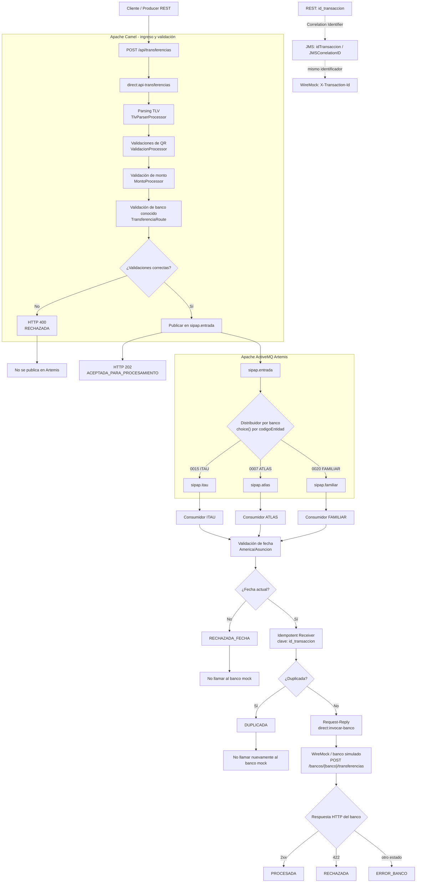

# Diagrama de arquitectura de la Tarea 2

El diagrama representa el flujo implementado desde la entrada REST hasta el resultado del banco simulado. Las líneas punteadas muestran la conservación de `id_transaccion` como Correlation Identifier entre REST, JMS y WireMock.

La respuesta HTTP `202` confirma que la transferencia válida fue publicada para procesamiento; los estados posteriores se producen de forma asíncrona. Los casos `RECHAZADA_FECHA` y `DUPLICADA` terminan antes de `direct:invocar-banco`, por lo que no generan una llamada a WireMock.
